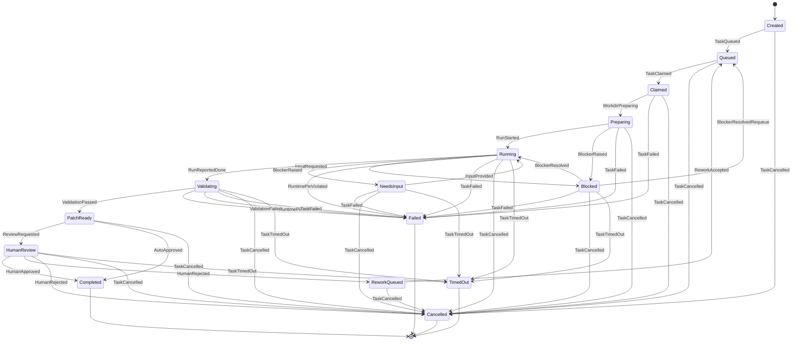
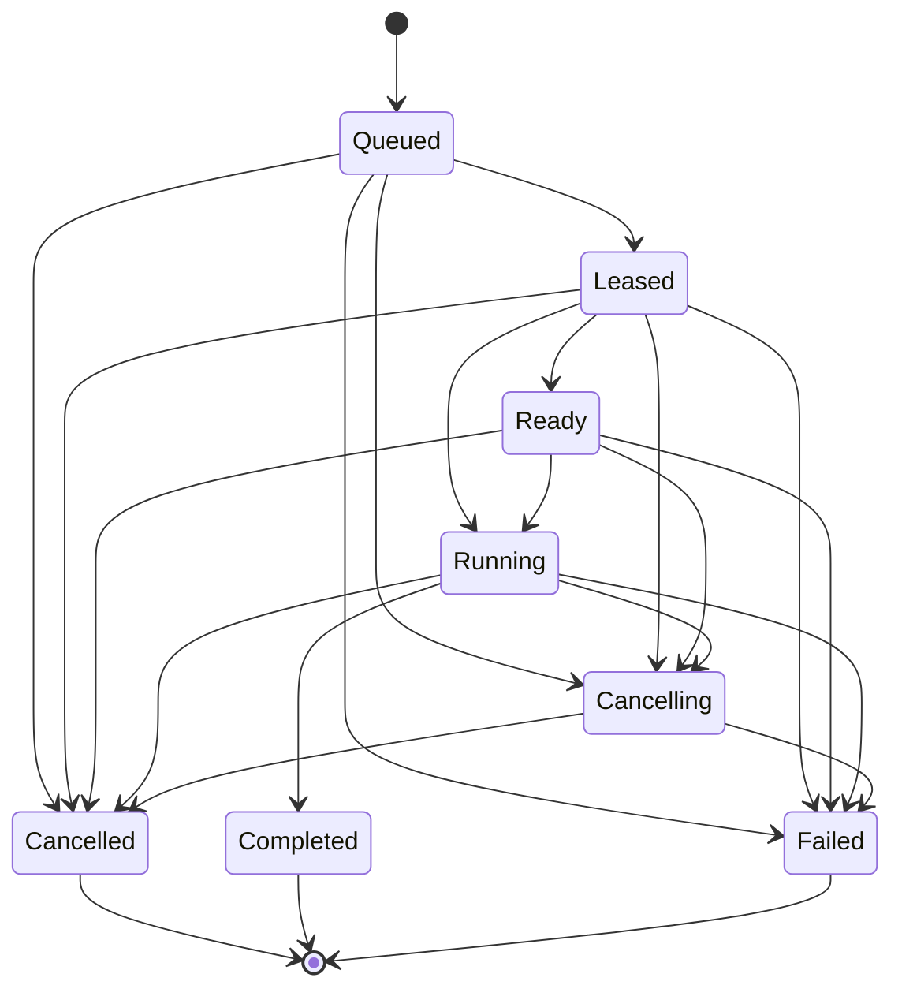

# riido-contracts

<!-- Generated by go run ./tools/repositoryreadme -write-doc. Do not edit by hand. -->

> Riido task: RIID-4964

Executable SSOT: [`README.riido.json`](README.riido.json).

`riido-contracts`는 Riido 레포지토리들이 함께 써야 하는 계약, 스키마, enum, API projection fixture를 모아두는 공개 Go module입니다.

이 레포의 목적은 구현을 옮기는 것이 아니라, 여러 레포가 같은 사실을 다르게 적지 않도록 공유 계약의 기준점을 만드는 것입니다. AI Agent client API의 DSL, IR, OpenAPI fixture는 여기서 정의하고, `riido-control-plane`은 그 projection을 소비해 development API와 generated client drift gate를 맞춥니다.

## 이 레포가 하는 일

- task lifecycle, IR event, provider capability 같은 공유 vocabulary를 Go package로 제공합니다.
- 여러 레포가 함께 읽어야 하는 API 계약을 DSL -> IR -> OpenAPI 흐름으로 고정합니다.
- enum과 sum type을 DSL/IR 단계에서 명시해 client codegen이 문자열 추측에 의존하지 않도록 합니다.
- downstream 레포가 import할 수 있는 작고 안정적인 public module boundary를 유지합니다.

## 이 레포가 하지 않는 일

- daemon/provider 실행, runtime probing, 로컬 프로세스 제어를 구현하지 않습니다.
- control-plane HTTP handler, store, authorization adapter를 구현하지 않습니다.
- Terraform, AWS 계정 정보, 배포 evidence, secret 값을 소유하지 않습니다.
- provider CLI binary를 포함하지 않습니다.

## 왜 이 작업을 여기서 했나

- AI Agent 기능은 `riido-daemon`, `riido-control-plane`, web/desktop client, 그리고 infra가 같은 단어와 같은 API shape를 공유해야 합니다. 그래서 런타임, 에이전트, 디바이스, 데몬, 클라이언트 같은 보편언어와 agent visibility, runtime availability, task comment status 같은 enum은 contracts가 소유합니다.
- OpenAPI는 사람이 직접 고치는 SSOT가 아닙니다. Domain DSL이 원본이고, API IR이 기계가 검증하는 canonical contract이며, OpenAPI는 client/development API/docs를 위한 생성물입니다.

## 어떤 문서를 보면 되나

| 알고 싶은 것 | 문서 |
| --- | --- |
| 이 레포가 왜 공유 계약만 소유하는지 | [`docs/30-architecture/module-decomposition.md`](docs/30-architecture/module-decomposition.md) |
| bounded context와 각 package 책임 | [`docs/20-domain/context-map.md`](docs/20-domain/context-map.md) |
| AI Agent 보편언어와 정책 단언 | [`docs/20-domain/ai-agent-policy.md`](docs/20-domain/ai-agent-policy.md) |
| API DSL -> IR -> OpenAPI projection 규칙 | [`docs/20-domain/api-contract-projection.md`](docs/20-domain/api-contract-projection.md) |
| SSOT 간 의존 방향과 작업 루프 | [`docs/30-architecture/ssot-dependency-map.md`](docs/30-architecture/ssot-dependency-map.md) |
| SSOT 의존 방향의 기계 검증 manifest | [`docs/30-architecture/ssot-dependency-map.riido.json`](docs/30-architecture/ssot-dependency-map.riido.json) |
| Figma v1.22 AI Agent 화면 커버리지와 SSOT 흡수 상태 | [`docs/30-architecture/figma-ai-agent-coverage.md`](docs/30-architecture/figma-ai-agent-coverage.md) |
| Figma 화면 커버리지의 기계 검증 manifest | [`docs/30-architecture/figma-ai-agent-coverage.riido.json`](docs/30-architecture/figma-ai-agent-coverage.riido.json) |
| 계약을 언제 public module로 승격할지 | [`docs/30-architecture/contract-promotion-policy.md`](docs/30-architecture/contract-promotion-policy.md) |
| 레포 간 어떤 artifact를 주고받는지 | [`docs/30-architecture/integration-matrix.md`](docs/30-architecture/integration-matrix.md) |
| 마이그레이션 중 남은 맥락 | [`docs/migration/contracts.md`](docs/migration/contracts.md) |
| 아직 결정되지 않은 질문 | [`docs/50-roadmap/open-questions.md`](docs/50-roadmap/open-questions.md) |

## 현재 package

- `assignment`: SaaS assignment polling DTO, task event vocabulary, runtime binding DTO를 제공합니다.
- `apicontract`: API DSL, API IR, OpenAPI projection fixture, enum/sum-type contract, drift verifier/generator를 소유합니다.
- `fsmmeta`: public FSM pattern vocabulary와 conformance profile codegen 결과를 제공합니다.
- `ir`: canonical event envelope, event catalog, reducer contract, envelope validation을 소유합니다.
- `hostintegration`: distribution channel과 provider routing status vocabulary를 공유합니다.
- `progressmessage`: AI Agent runtime progress message의 integer code, locale template, usage classification, append-only fixture를 소유합니다.
- `provider/capability`: provider capability, protocol identifier, compatibility status, fingerprint vocabulary를 소유합니다.
- `task`: task lifecycle state와 transition matrix를 소유합니다.

## Generated FSM

`enumgen/enums.lisp`는 enum 값만이 아니라 public FSM 전이의 Common Lisp SSOT입니다. `fsmgen/patterns.lisp`는 FSM 패턴 sum type과 conformance profile의 별도 Common Lisp source입니다. `tools/enumgen`이 iota 기반 enum/transition 코드를 만들고, `tools/fsmgen`은 같은 원천의 전이를 Go SPI, `fsmmeta` 패턴 vocabulary, Mermaid 문서 블록으로 투영합니다.

각 `transitions` 블록은 `:fsm-type-union`, `:pattern-source`, `:conformance-profile`, `:patterns`, `:start-points`, `:end-points`, `:readme-section` 메타를 가져야 합니다. runtime에서 경로를 조립하지 않고 build 시점에 상태/전이 경로가 확정되어야 합니다.

Task lifecycle:

<!-- fsmgen:task:start -->

<!-- fsmgen:task:end -->

Assignment polling:

<!-- fsmgen:assignment:start -->

<!-- fsmgen:assignment:end -->

## 중요한 결정

- Go dependency는 표준 라이브러리만 허용합니다.
- `task -> ir` 방향은 허용하지만, `ir`이 `task`를 import하면 안 됩니다.
- Terraform/AWS/Docker/provider 실행 정보는 이 레포에 들어오면 안 됩니다.
- generated OpenAPI가 DSL/IR과 다르면 OpenAPI를 고치는 것이 아니라 DSL에서 다시 생성해야 합니다.

## 검증

```bash
go test ./...
go list -m all
go run ./tools/enumgen verify
go run ./tools/fsmgen conformance
go run ./tools/fsmgen verify
go run ./tools/apicontract verify
go run ./tools/progressmessage verify
go run ./tools/ssotdeps verify
go run ./tools/repositoryreadme -check-doc -evidence-out out/repository-readme-evidence.json
go run ./tools/knowledgecoverage -check-doc -evidence-out out/executable-knowledge-coverage.json
```

## Rules

- `go list -m all`은 이 module만 보여야 합니다. 새 third-party dependency가 필요해지면 먼저 별도 결정 문서가 필요합니다.
- README의 FSM Mermaid 블록은 `tools/fsmgen`이 소유합니다. repository README generator는 블록 위치와 주변 문서 골격만 소유합니다.
- 새 공유 vocabulary는 package code만 추가하지 말고, DSL/IR/fixture/evidence tool 중 어느 SSOT가 원천인지 먼저 정해야 합니다.

## Evidence Loop

| Step | Statement |
| --- | --- |
| Observe | 루트 README가 contracts의 공유 계약 경계와 FSM 문서를 담고 있었지만 README 자체는 hand-maintained markdown이어서 executable knowledge coverage에서 manual reader로 남았다. |
| Hypothesis | README를 manifest에서 생성하고 fsmgen이 소유한 Mermaid 블록만 조합 입력으로 보존하면 루트 entrypoint도 실행 가능한 SSOT reader가 된다. |
| Execute | README.riido.json에서 README.md 골격을 생성하고, repositoryreadme tool이 링크, marker, forbidden literal, freshness, evidence artifact를 검증한다. |
| Evaluate | CI는 repository-readme evidence와 executable-knowledge coverage evidence를 업로드하고, coverage status가 verified/manual_count=0으로 돌아와야 한다. |
| Retrospective | contracts의 루트 entrypoint는 사람이 임의로 편집하는 설명문이 아니라 manifest + fsmgen block으로 조립되는 evidence-backed reader가 된다. |

## Module

```text
github.com/teamswyg/riido-contracts
```

## License

Apache-2.0.
